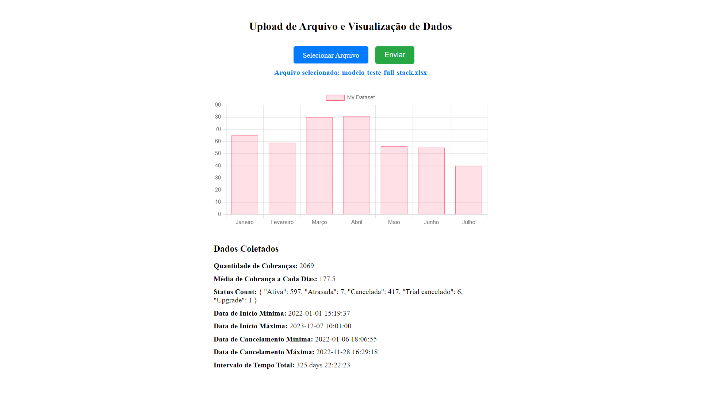

# Projeto de Análise de Dados com Backend em Python e Frontend em Vue.js

Este projeto consiste em uma aplicação web que permite o upload de planilhas no formato .xlsx ou .csv e exibe gráficos interativos das métricas calculadas a partir dos dados fornecidos na planilha. A parte do backend foi desenvolvida em Python, enquanto o frontend foi implementado utilizando Vue.js.

## Requisitos

Antes de iniciar a instalação do projeto, é necessário ter o Docker instalado em sua máquina.

- Docker: [Download Docker](https://docs.docker.com/get-docker/)

## Instalação e Execução

Siga os passos abaixo para instalar e executar o projeto:

### 1. Clonar o repositório
git clone https://github.com/Isaell-Kelson/MetricsDashboard

### Usando DockerCompose
docker-compose up

### Rodando de forma individualizada com o Docker

### 2. Backend (Python)

#### 2.1. Construir e Executar o Contêiner Docker

No terminal, navegue até o diretório raiz do projeto e execute o seguinte comando para construir e executar o contêiner Docker do backend:

docker build -t backend -f dockerfile.backend  
docker run -d -p 5001:5001 backend  
O servidor estará rodando em `http://127.0.0.1:5001`.

### 3. Frontend (Vue.js)

#### 3.1. Construir e Executar o Contêiner Docker

No terminal, ainda no diretório raiz do projeto, execute o seguinte comando para construir e executar o contêiner Docker do frontend:  

docker build -t frontend -f dockerfile.frontend  
docker run -d -p 8080:8080 frontend  
A aplicação estará disponível em `http://localhost:8080`.

## Utilização

Após iniciar a aplicação, acesse-a através do navegador e você será direcionado para a página de upload de planilhas. Faça o upload da planilha que está na pasta UPLOAD e aguarde o processamento dos dados. Após o processamento, a aplicação exibirá os gráficos interativos das métricas calculadas.

## Tecnologias Utilizadas

- Backend (Python):
  - Flask: Framework web para Python.
  - Pandas: Biblioteca para manipulação e análise de dados.
  - Flask-CORS: Extensão para permitir requisições cross-origin no Flask.
 
- Frontend (Vue.js):
  - Vue.js: Framework JavaScript progressivo para construção de interfaces de usuário.
  - Chart.js: Biblioteca para criação de gráficos.
  - Axios: Cliente HTTP baseado em Promises para fazer requisições para o backend.
  
